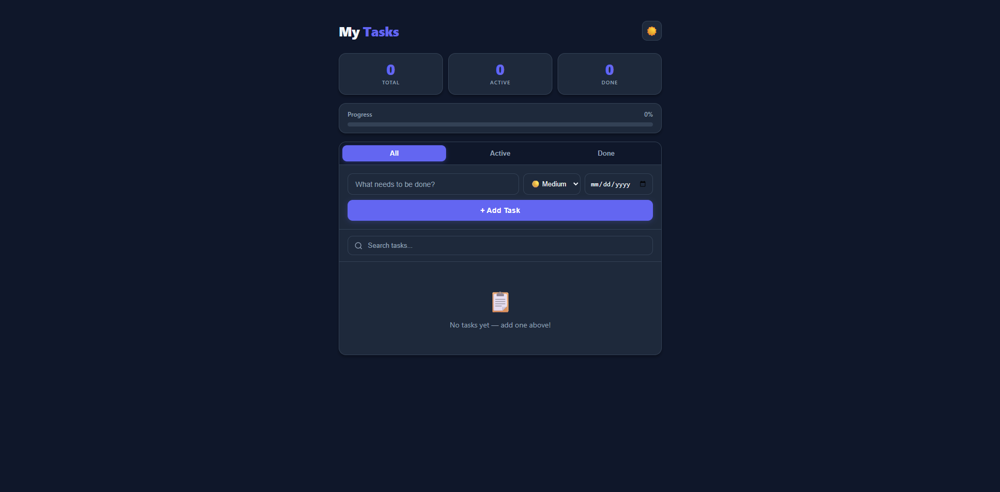
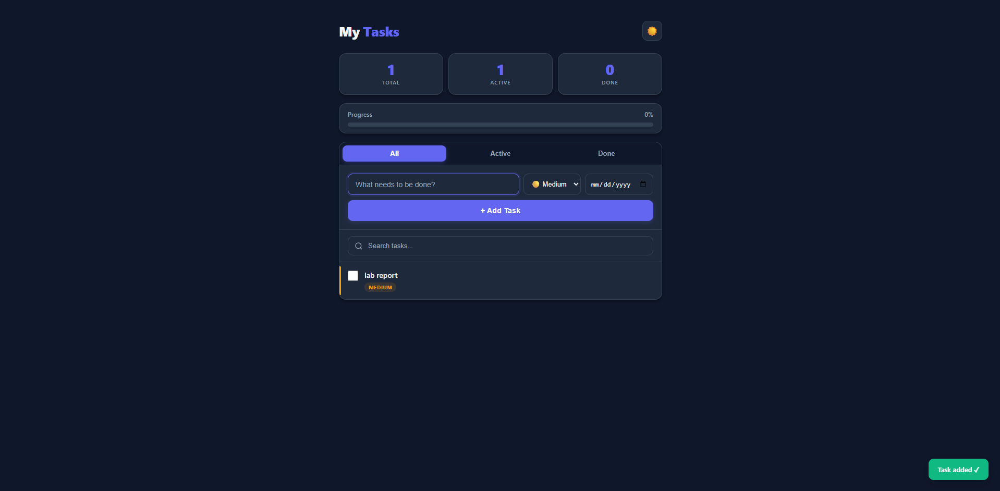
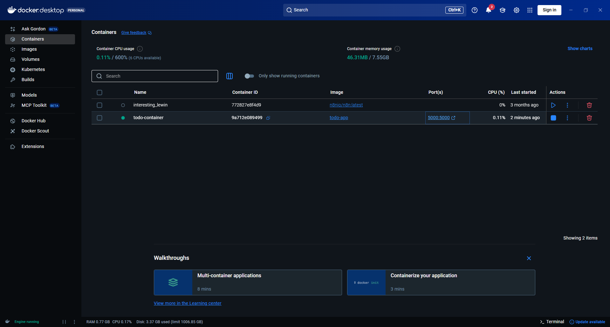

# Todo App (Flask) — Dockerized
 
<p align="center">
  
  
  
  
  
  
  
  
  
  
</p>
A clean and simple **To-Do web application** built with **Python Flask** and packaged for easy deployment using **Docker**.
 
Tasks are stored in a local **`data/tasks.json`** file (persistent on the container filesystem; mount a volume for durability across restarts).
 
---

## Screenshots

### App UI



### Adding a Task



### Docker Desktop — Container Running



---

## Features

- Add / edit / delete / toggle tasks
- Priority levels: Low, Medium, High (color-coded stripe)
- Due dates with overdue detection
- Search tasks
- Filter by All / Active / Done
- Stat cards (Total, Active, Done) + progress bar
- Dark mode (persisted in browser)
- Toast notifications
- Instant UI updates via fetch API (no page reload)
- Container-friendly: reproducible runtime with pinned dependencies

---

## Architecture

```
Browser (fetch API) → Flask routes → data/tasks.json
```

| Route              | Method      | Description                           |
| ------------------ | ----------- | ------------------------------------- |
| `/`                | GET         | Renders the main UI                   |
| `/add`             | POST        | Adds a new task                       |
| `/toggle/<id>`     | POST        | Toggles task complete/incomplete      |
| `/edit/<id>`       | POST        | Updates task text, priority, due date |
| `/delete/<id>`     | DELETE/POST | Removes a task                        |
| `/clear-completed` | POST        | Deletes all completed tasks           |
| `/api/tasks`       | GET         | Returns all tasks as JSON             |

---

## Project Structure

```
todo-app-docker/
├── app.py                  # Flask backend (routes + JSON storage)
├── Dockerfile              # Docker build instructions
├── requirements.txt        # Python dependencies (Flask 3.0.3)
├── data/
│   └── tasks.json          # Task storage (auto-created on first run)
├── templates/
│   └── index.html          # Frontend UI (HTML + CSS + JS)
├── images/
│   ├── todo_ui.png         # Screenshot — empty state
│   ├── task_add.png        # Screenshot — task added
│   └── docker_ss.png       # Screenshot — Docker Desktop
└── README.md               # This file
```

---

## Prerequisites

- [Docker Desktop](https://www.docker.com/products/docker-desktop/) installed and running
- (Optional) WSL2 enabled for Linux container mode on Windows

---

## Quick Start

### 1. Build the Docker image

```bash
docker build -t todo-app .
```

### 2. Run the container

```bash
docker run -d --name todo-container -p 5000:5000 todo-app
```

### 3. Open the app

```
http://localhost:5000
```

> ⚠️ Do **not** open `index.html` directly or use VS Code Live Server — the app requires the Flask backend to function.

---

## Data Persistence (Volume Mount)

Tasks are saved inside the container at `/app/data/tasks.json`. To persist data across container restarts, mount a local folder:

**Windows (PowerShell):**

```powershell
docker run -d --name todo-container -p 5000:5000 -v ${PWD}/data:/app/data todo-app
```

**Linux / macOS:**

```bash
docker run -d --name todo-container -p 5000:5000 -v $(pwd)/data:/app/data todo-app
```

---

## Useful Docker Commands

| Command                         | Description             |
| ------------------------------- | ----------------------- |
| `docker ps`                     | View running containers |
| `docker logs todo-container`    | View app logs           |
| `docker stop todo-container`    | Stop the container      |
| `docker rm todo-container`      | Remove the container    |
| `docker rmi todo-app`           | Remove the image        |
| `docker restart todo-container` | Restart the container   |

---

## Tech Stack

| Component       | Purpose                      |
| --------------- | ---------------------------- |
| Python 3.11     | Backend runtime              |
| Flask 3.0.3     | Web server + API routes      |
| Docker          | Containerization             |
| HTML / CSS / JS | Frontend UI                  |
| JSON file       | Lightweight task persistence |

---

## License

MIT

---

## Author

**Shahriar Alom Masud**  
B.Sc. Engg. in IoT & Robotics Engineering  
University of Frontier Technology, Bangladesh  
📧 shahriar0002@std.uftb.ac.bd  
🔗 [LinkedIn](https://www.linkedin.com/in/shahriar-alom-masud)
